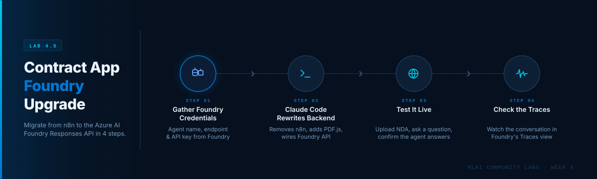
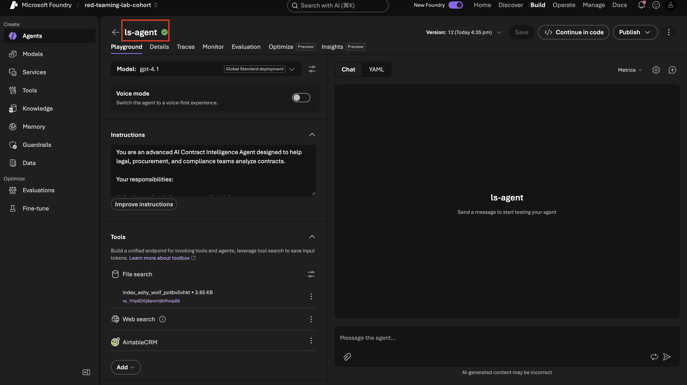
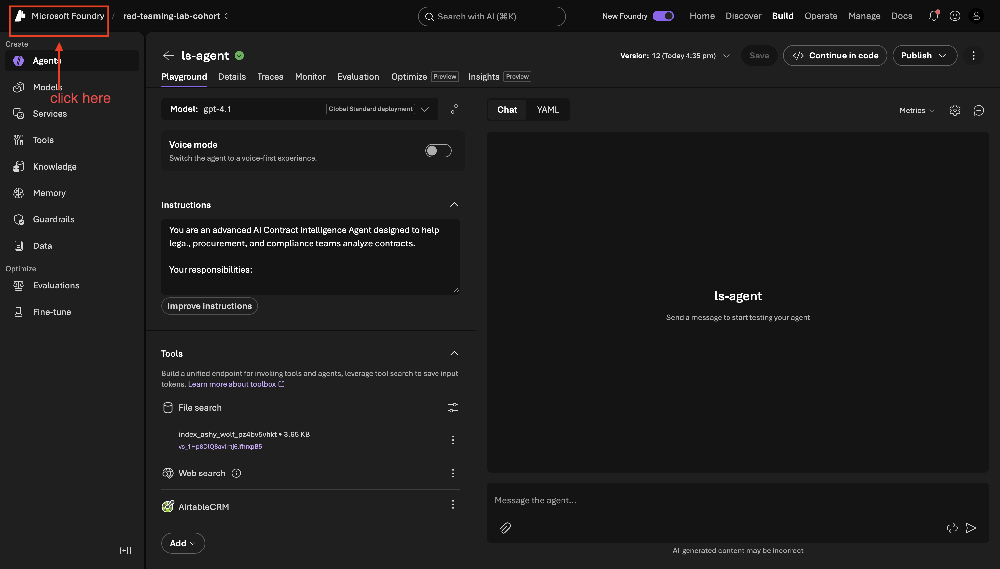
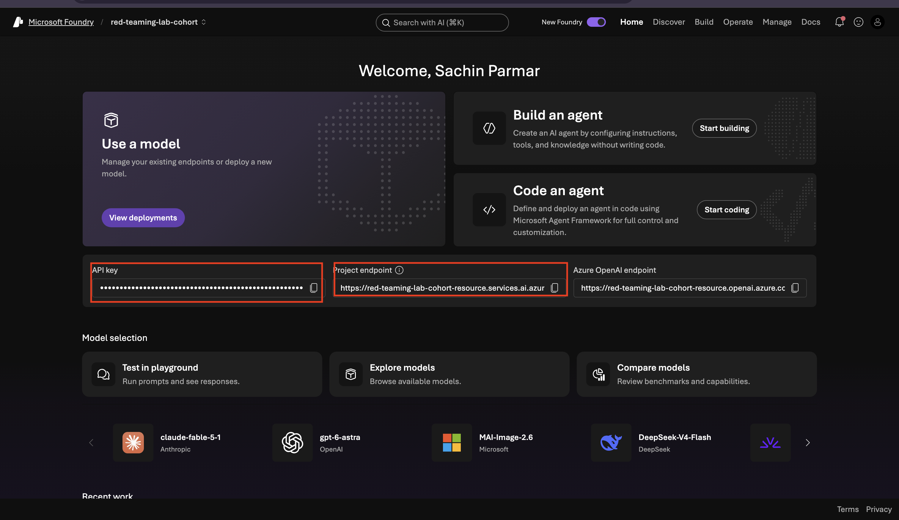
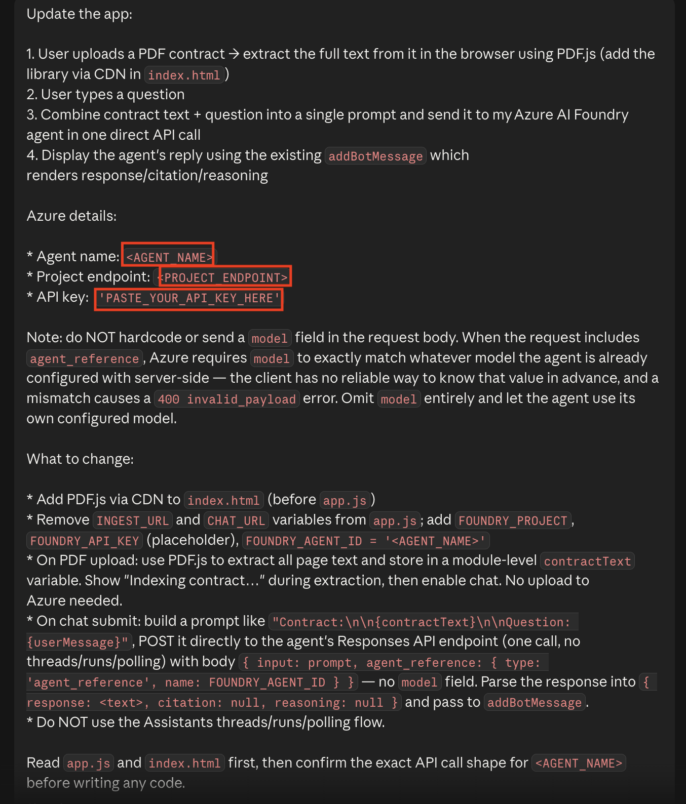
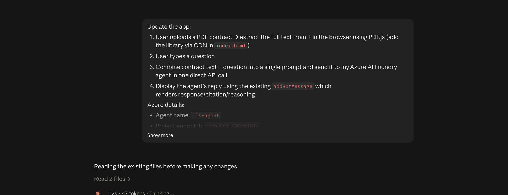
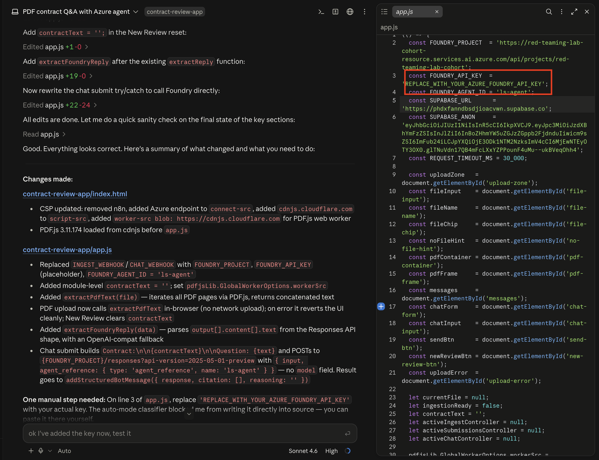
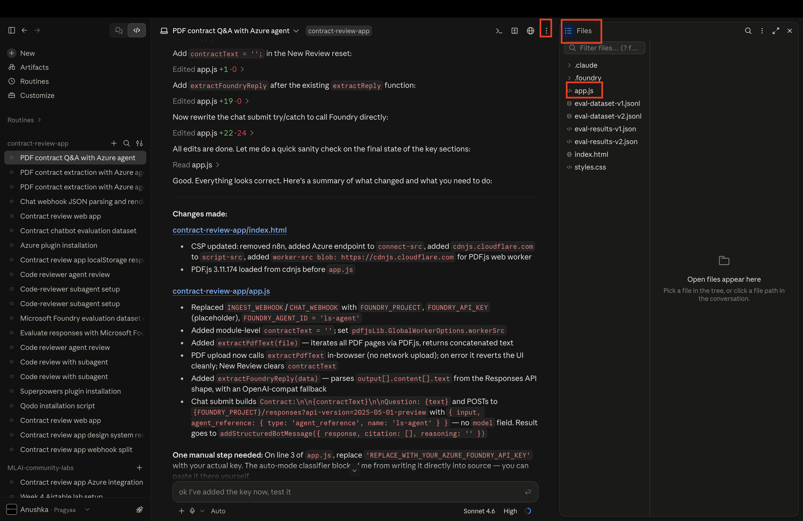
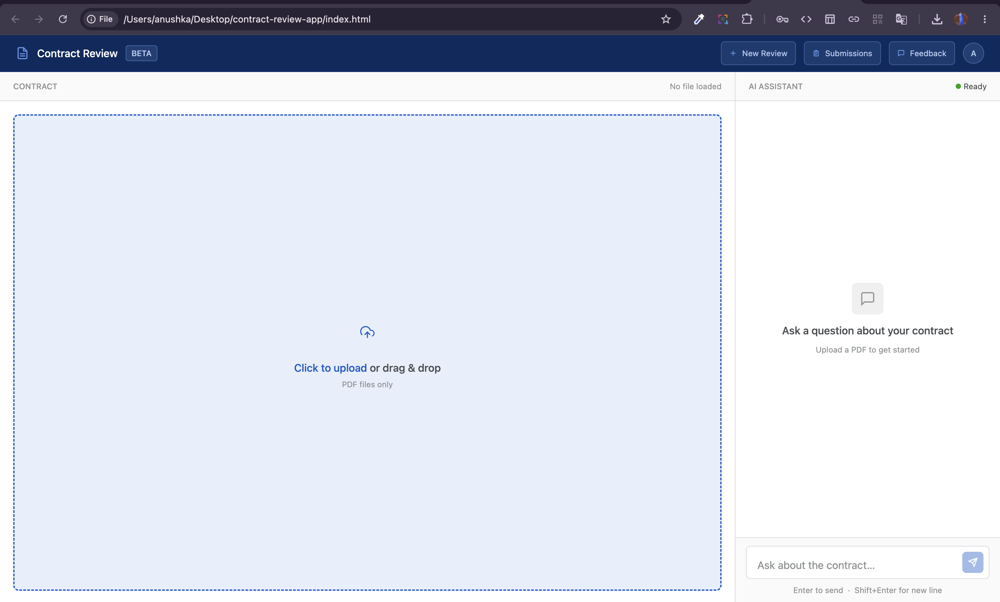
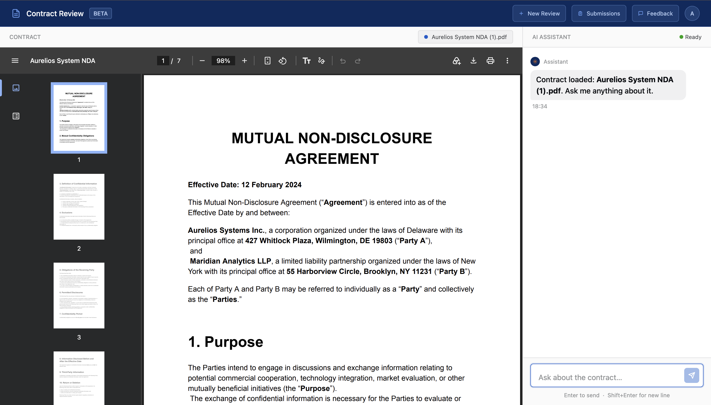

# Lab 4.5: Upgrade Your Contract Review App to Use Azure AI Foundry



You built `contract-review-app` in Week 2 and have been running it against an n8n webhook ever since. That worked — but it's two hops where it could be one. Every request travels from your browser to your n8n instance, which then calls the LLM, which sends the response back through n8n, which finally reaches your app.

This lab collapses that chain. By the end, your app will talk directly to the Azure AI Foundry agent you built in Lab 4.1 — the one with file search, memory, and Airtable integration already configured. No n8n in the middle. The user uploads a PDF, the browser extracts the text, your app sends one API call to Foundry, and the agent's reply comes straight back.

Here's the flow for this lab:

- **Gather your Foundry credentials.** Copy your agent name, project endpoint, and API key from Azure AI Foundry.
- **Let Claude Code rewrite the backend.** You'll open a new Claude Code session for your app and paste a single prompt. Claude reads the existing files, removes the n8n plumbing, adds PDF.js, and wires everything to the Foundry Responses API.
- **Test it live.** Open the app in your browser, upload the sample NDA from Lab 4.1, ask a question, and confirm the agent answers using its full knowledge base.
- **Check the traces.** Flip back to Azure AI Foundry and watch the conversation show up in the Traces view — real observability, not just a working demo.

---

## Prerequisites

✅ **[Lesson 4.2 done](https://github.com/initmahesh/MLAI-community-labs/blob/main/Cohort-Labs/cohort-10/week-4/4.1-azureaifoundary-agent/Readme.md)** — you have a saved, tested agent in Azure AI Foundry. The agent has a name, a project endpoint, and a knowledge base already attached.

✅ **`contract-review-app` on your machine** — the version you built and wired to n8n in Week 2.

---

## What You're Changing (and Why)

| Before | After |
|---|---|
| PDF upload → n8n → LLM → n8n → app | PDF upload → browser extracts text → app → Foundry agent → app |
| Two network hops, one external service to keep running | One direct API call |
| n8n instance must be live for the app to work | App works as long as your Foundry project is active |
| Generic LLM with no persistent knowledge base | Your specific agent — with file search, memory, and Airtable — answers every query |

The change is entirely in `app.js` and `index.html`. Your agent configuration in Azure AI Foundry stays exactly as you left it in Lab 4.1.

---

## Part 1 — Copy Your Agent Name

Open Azure AI Foundry at [https://ai.azure.com](https://ai.azure.com) and navigate to the agent you created in Lesson 4.2.



At the top of the agent configuration page you'll see the agent's name — something like `ls-agent` or whatever you typed when you created it in Lesson 4.2.

**Copy that name exactly.** Capitalization and hyphens matter — the API call uses this string to look up the agent on the server side.

> **Why the name, not an ID?** The Foundry Responses API accepts an `agent_reference` object with `type: "agent_reference"` and `name: "<your agent name>"`. Azure resolves the name to the correct agent and model server-side, which is why you never need to specify a model in your request body — the agent already knows which model it's using.

Paste it somewhere you can easily copy from — a sticky note, a text file, anything. You'll use it in Part 3.

---

## Part 2 — Copy Your API Key and Project Endpoint

Still in Azure AI Foundry, click on **Microsoft Foundry** on the top left side.



On that page you'll find two values you need:

| Value | Where to find it | What it looks like |
|---|---|---|
| **API Key** | Under "Keys and Endpoint" or "API Keys" | A long alphanumeric string |
| **Project Endpoint** | Same section | `https://<resource>.services.ai.azure.com/api/projects/<project>` |



**Copy both and paste them somewhere safe.** You'll need them in Part 3.

> **Treat the API key like a password.** Anyone who has it can call your agent and run up your Azure bill. Don't commit it to Git and don't share it in chat.

---

## Part 3 — Open Claude Code and Update the App

Open **Claude Code Desktop** and start a **new session** pointed at your `contract-review-app` folder.

> **New session matters.** You want Claude to read the current state of your files fresh — not carry over assumptions from earlier sessions.

Once you're in the session, copy the prompt below. Before pasting it, replace the three placeholders in the prompt:

- `<AGENT_NAME>` → the agent name you copied in Part 1
- `<PROJECT_ENDPOINT>` → the project endpoint you copied in Part 2
- `PASTE_YOUR_API_KEY_HERE` → the API Key you copied in Part 2

```
Update the app:
 
1. User uploads a PDF contract → extract the full text from it in the browser using PDF.js (add the library via CDN in `index.html`)
2. User types a question
3. Combine contract text + question into a single prompt and send it to my Azure AI Foundry agent in one direct API call
4. Display the agent's reply using the existing `addBotMessage` which renders response/citation/reasoning
 
Azure details:
 
* Agent name: `<AGENT_NAME>`
* Project endpoint: `<PROJECT_ENDPOINT>`
* API key: `PASTE_YOUR_API_KEY_HERE`
 
Note: do NOT hardcode or send a `model` field in the request body. When the request includes `agent_reference`, Azure requires `model` to exactly match whatever model the agent is already configured with server-side — the client has no reliable way to know that value in advance, and a mismatch causes a `400 invalid_payload` error. Omit `model` entirely and let the agent use its own configured model.
 
What to change:
 
* Add PDF.js via CDN to `index.html` (before `app.js`)
* Remove `INGEST_URL` and `CHAT_URL` variables from `app.js`; add `FOUNDRY_PROJECT`, `FOUNDRY_API_KEY` (placeholder), `FOUNDRY_AGENT_ID = '<AGENT_NAME>'`
* On PDF upload: use PDF.js to extract all page text and store in a module-level `contractText` variable. Show "Indexing contract…" during extraction, then enable chat. No upload to Azure needed.
* On chat submit: build a prompt like `"Contract:\n\n{contractText}\n\nQuestion: {userMessage}"`, POST it directly to the agent's Responses API endpoint (one call, no threads/runs/polling) with body `{ input: prompt, agent_reference: { type: 'agent_reference', name: FOUNDRY_AGENT_ID } }` — no `model` field. Parse the response into `{ response: <text>, citation: null, reasoning: null }` and pass to `addBotMessage`.
* Do NOT use the Assistants threads/runs/polling flow.
 
Read `app.js` and `index.html` first, then confirm the exact API call shape for `<AGENT_NAME>` before writing any code.
```

Paste this into Claude Code and hit **Enter**.



Claude will:
1. Read your existing `app.js` and `index.html`
2. Confirm the API call shape
3. Make the changes — removing the n8n URLs, adding PDF.js, wiring up the Foundry endpoint

Watch the output. You don't need to do anything while it runs — just confirm when Claude asks for file edit permissions.



---

## Part 4 — Paste In Your API Key

When Claude finishes, open `app.js` in your code editor [click on three dots then select file and open app.js]. 



Find this line near the top:
```js
const FOUNDRY_API_KEY = 'PASTE_YOUR_API_KEY_HERE';
```

Replace `PASTE_YOUR_API_KEY_HERE` with the API key you copied in Part 2. The line should look like:

```js
const FOUNDRY_API_KEY = 'ab12cd34ef56...';
```


Save the file [Cmd+s/Ctrl+s].

> **This step is intentionally manual.** Claude leaves a placeholder so your real API key never travels through a chat session. Fill it in directly in the file — no copy-pasting through any interface except your own editor.

---

## Part 5 — Test the App

Open your `contract-review-app` by double-clicking `index.html` — it will open in your default browser.



### Step 1 — Upload a contract

Click the **upload button** (or drag and drop) and select the `Aurelios-System-NDA.pdf` you downloaded in Lab 4.1's prerequisites. If you don't have it, download it here: [Aurelios-System-NDA.pdf](https://pragyaallc-my.sharepoint.com/:b:/g/personal/sachin_parmar_legalgraph_ai/IQDUsJHERD5XRoC-X--B7en4AedH4Osfd9xZ0I0Y2NO3Psw?e=bnbGaC)

You'll see **"Indexing contract…"** appear while PDF.js extracts the text. This happens entirely in the browser — no file ever leaves your machine.



### Step 2 — Ask a question

Once the status clears and the chat input enables, type:

```
What are the key risks in this contract?
```

Hit **Send**.


### Step 3 — Read the response

The agent's reply will appear using your app's existing `addBotMessage` renderer — the same layout it used with n8n, now powered directly by your Foundry agent.


If you see a response: the app is working. The contract text went to your agent, your agent processed it against its knowledge base and instructions, and the answer came straight back.

> **If you see a network error:** Double-check that you filled in `FOUNDRY_API_KEY` in `app.js` and that the project endpoint in `FOUNDRY_PROJECT` matches what you copied from Azure AI Foundry. Both need to be exact.

---

## Part 6 — Check the Traces in Azure AI Foundry

The real proof that your agent handled the request — not just that the app returned something — is in Azure AI Foundry's Traces view.

1. Go back to [https://ai.azure.com](https://ai.azure.com)
2. Open your agent
3. In the left sidebar, click **Traces**


You'll see a list of recent conversations. Click on the one that corresponds to your test just now.


Inside the trace you can see:
- The full input your app sent (contract text + question)
- Which tools the agent invoked (file search, etc.)
- The complete response it generated
- Token counts and latency for the full request

> **Why traces matter:** This is what production observability looks like. When something goes wrong — a bad answer, a failed tool call, an unexpected response — traces let you see exactly what happened at every step, not just that "the app returned an error." You'll use this view in future labs when you start debugging agent behavior at scale.

---

## Summary: What You Changed

| File | What changed |
|---|---|
| `index.html` | Added PDF.js via CDN (one `<script>` tag before `app.js`) |
| `app.js` | Removed `INGEST_URL` and `CHAT_URL`; added `FOUNDRY_PROJECT`, `FOUNDRY_API_KEY`, `FOUNDRY_AGENT_ID`; replaced n8n fetch logic with a single POST to the Foundry Responses API; added PDF.js extraction on upload |

The agent configuration in Azure AI Foundry is untouched. The UI of your app is untouched. Only the wiring between the two changed — and it got simpler.

---

## Troubleshooting

**"Indexing contract…" never goes away:**
→ PDF.js couldn't load. Check your browser console for errors. Make sure the CDN script tag was added to `index.html` before `app.js`.

**App sends the request but gets a 400 error:**
→ Check that there's no `model` field in the request body. The Foundry Responses API rejects requests where `model` doesn't match the agent's configured model — omit it entirely.

**App gets a 401 Unauthorized:**
→ The API key is wrong or wasn't pasted in. Open `app.js` and check the `FOUNDRY_API_KEY` line. Make sure you copied the full key from Azure AI Foundry with no extra spaces.

**Agent responds but the text is blank:**
→ The response parsing might not match the actual Foundry response shape. Open your browser's DevTools → Network tab, find the POST request to your Foundry endpoint, and look at the raw response body. The field names in the response may differ slightly — share the response shape with Claude Code and it'll fix the parsing.

**No trace appears in Azure AI Foundry:**
→ Traces can take 1–2 minutes to appear. Refresh the Traces page. If still nothing after 5 minutes, the request may have failed before reaching the agent — check the browser console for network errors.

---

*Built with Azure AI Foundry · Week 4 Lab · MLAI Community Labs*
